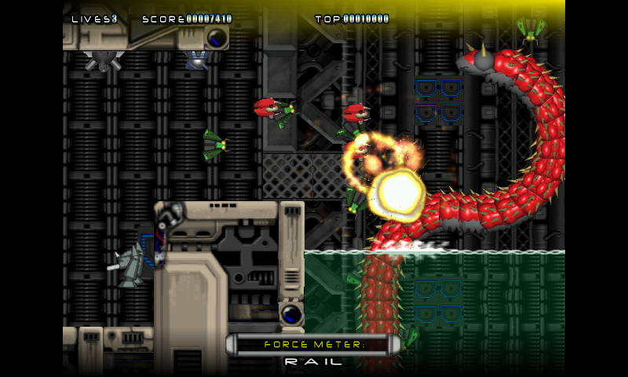

# prototype
===========

This is ProtoType, an RType remake from Dark Castle Software.
This version compile on OpenPAndora, Linux and ODROID, has the FMOD dependancy removed (using SDL_mixer instead), and has a few fixes in the code.
You will need libdevil (image library), on debian and friends, it's `sudo apt install libdevil-dev`

On Pandora and ODROID, it use [gl4es](http://github.com/ptitSeb/gl4es).

To compile on Pandora, type
'make'

To compile on ODROID, type
'make ODROID=1'

To compile on Linux x86, type
'make LINUX=1'

For more info, the website of the original game is here: http://xout.blackened-interactive.com/ProtoType/Prototype.html

For info on the Pandora version, go there: https://pyra-handheld.com/boards/threads/prototype.71887/

